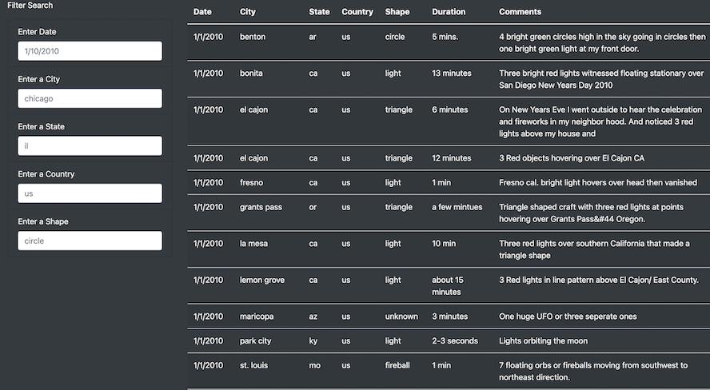
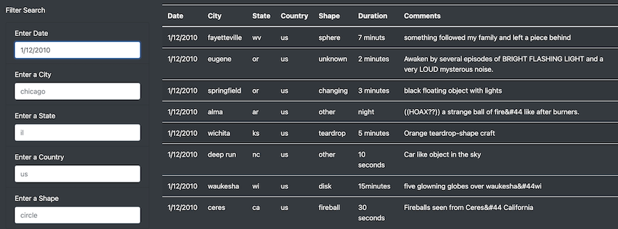
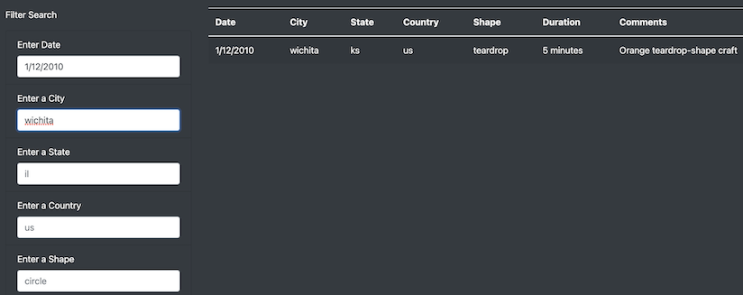

# UFOs
UFO Sightings with JavaScript

## Project Overview

The purpose of this project was to build a dynamic webpage about UFOs that accepts user inputs, where the user can filter through multiple options, on which the website visually displays the result of the selection criteria simultaneously and at the same time deliver a visually appealing and interactive webpage.

# Design Solution

- A table was created to hold the UFOs data
- Filters for searching criteria were added to that table 
- The table was then inserted into the index.html file
- A header, article summary, and brief article were added to the page.
- Basic HTML, Bootstrap, and CSS were used to build and style the webpage.

## Results

### Webpage

- UFOs Sighting webpage 
    - Header, article summary, and brief article.

- Data Table without any filter applied

### Search Criteria

To use the search option, the user would click on the input field where it says "1/10/2010" and enter the date of their choice to see if there was any UFO seen on that specific date.

- Applying one filter
    - Enter Date: "1/12/2010"

To add another filter, for example, a city, on the input field that says where it says "chicago", which is the default city set as the example, the user would type the desired city such as "wichita". Now both the Date and City filters have been applied, and the results from that are displayed on the table data to the right of the search options. Every time a user changes the inputs on the filters, the table changes accordingly to display the results.

- Applying two filters
    - Enter Date: "1/12/2010"
    - Enter a city: "wichita"

## Summary

### Drawback

Its more efficient to have a date range instead of a specific date, to avoid the user selecting a date where there are no results. 

### Additional Recommendations

- When clicked on any input field the suggested value should be erased so that the user can see a clear field, this would help to avoid confusion for the user as it is not clear if an input has been inserted or not.

- The default placeholders could be modified to more clear options. For example, the placeholder for the date could be the date format "mm/dd/yyyy".

- Add a message to be displayed in case there are no values returned, for example: "Your search returned no results."

- Add a message for possible typing errors, for example: "the date entered is not in the correct format, please use mm/dd/yyyy."

- This is a small amount of data, but in case it was a large dataset bad performance of the website could happen so to avoid that it would be interesting to add a message to the user that at least one field has to be filled. 

- Add the autocomplete attribute for the inputs, so that when the user starts typing the program predicts the rest of the word.

- Another nice option would be to add a dropdown list for the city, state, country and shape to make it easier to choose only options that will return values.

